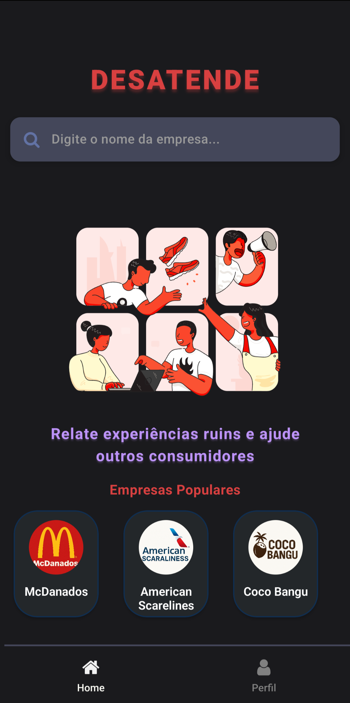
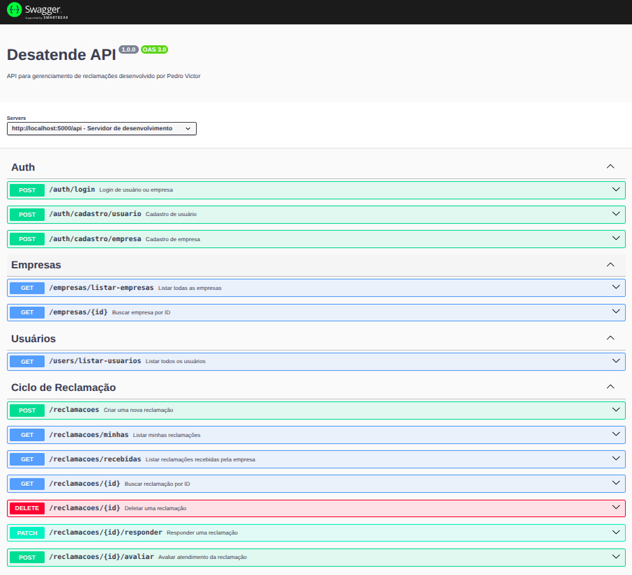
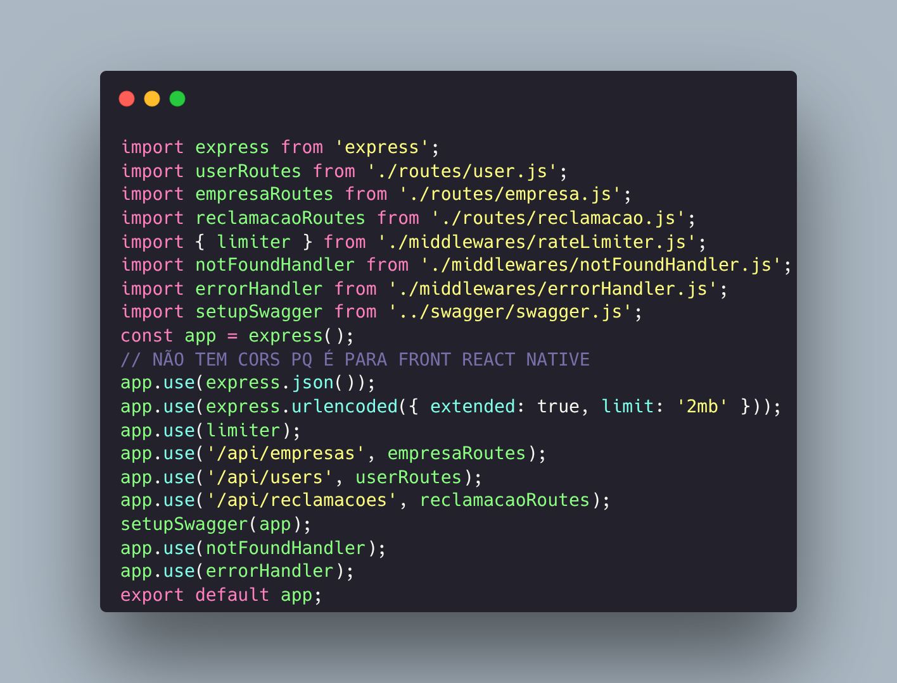

<!-- Aqui é o titulo! -->
<h1 align="center">
Desatende

</h1>

  

  
  
  
  
  
  

  
  
  
 

    

    
  
  
<i>API para registro e resposta de reclamações</i>

<!-- stacks -->

 

<h2 align="center">Objetivo do Projeto</h2> 

 Desatende é um app que desenvolvi sozinho para um projeto da faculdade, com backend focado em boas práticas e segurança. O nome “Desatende†une as palavras “desatenção†e “atendeâ€, deixando claro o propósito: registrar falhas no atendimento em setores como restaurantes, faculdades, companhias aéreas e outros. Usuários podem cadastrar reclamações, detalhando o ocorrido e a localização, e as reclamações são organizadas por categoria, facilitando a busca por setor. Empresas e instituições podem responder publicamente, promovendo transparência e resolução. O objetivo é criar uma comunidade onde experiências reais ajudam a pressionar por melhorias no atendimento e elevar o padrão de serviço.
O aplicativo não foi publicado em ambiente de produção como o Play Console e Render, sendo destinado exclusivamente a fins educacionais e sem fins lucrativos.

<h2 align="center">DOCS</h2>

Com o backend rodando, acesse <code>http://localhost:5000/api-docs</code> no navegador para testar a API pela interface gráfica Swagger UI.

<h2 align="center">Autenticação e Segurança</h2>

 A autenticação utiliza <code>JWT</code> para gerar e validar tokens de sessão de forma segura. Os tokens são assinados com uma chave secreta definida em variáveis de ambiente (<code>dotenv</code>), nunca expostos no código-fonte. As senhas dos usuários são validadas, possuem requisitos mínimos e são armazenadas já criptografadas usando <code>bcrypt</code>. O backend implementa validação de dados com <code>Joi</code> e limita tentativas abusivas de acesso através do <code>express-rate-limit</code>, protegendo a API contra ataques de força bruta e DDoS. Como o frontend é React Native, não há necessidade de configuração de <code>CORS</code>. O sistema possui fluxo completo de cadastro e autenticação, permitindo que novos usuários se registrem normalmente. 

<h2 align="center">Telas e funcionalidades</h2> 
 O aplicativo possui fluxo de autenticação com telas de login e cadastro, tanto para usuários quanto empresas. Após login, a <strong>Home</strong> lista empresas disponíveis, permitindo abrir um modal para envio de reclamações utilizando o método <code>POST</code> na API. Usuários autenticados podem acessar o <strong>Perfil</strong> para visualizar suas reclamações, deletar abertas e avaliar respostas recebidas após interação da empresa. A tela de perfil também conta com botão de logout seguro.    No dashboard da empresa, é possível visualizar todas as reclamações recebidas. Cada reclamação pode ser respondida diretamente pelo dashboard, utilizando o método <code>PATCH</code> para editar o status e a resposta do registro. Todo o fluxo é baseado em autenticação via <code>JWT</code> e integração direta com as rotas protegidas do backend. 

<h2 align="center">Stacks e principais tecnologias</h2> 
 O projeto utiliza <strong>React Native</strong> para a interface mobile, integração de APIs via <strong>Axios</strong>, backend construído em <strong>Node.js</strong> com <strong>Express</strong> e <strong>ESModules</strong>. O banco de dados é <strong>MongoDB</strong>, utilizando <strong>Mongoose</strong> como ODM.    A autenticação é baseada em <strong>JWT</strong> e as senhas são protegidas com <strong>bcrypt</strong>. O projeto adota <strong>Joi</strong> para validação de dados, <strong>express-rate-limit</strong> para limitar requisições e diversas outras bibliotecas para garantir boas práticas e segurança. 

<h2 align="center">Testes Automatizados</h2>

 Os testes unitários foram implementados com o <code>Poku</code> leve, rápido e brasileiro! 🇧🇷
Além disso, utilizei <code>Thunder Client</code> e <code>HTTPie</code> para testes manuais dos endpoints.

<h2 align="center">Como rodar o backend localmente</h2> <ol> <li> <strong>Clone este repositório:</strong> <pre><code>git clone https://github.com/mmyersbyte/appdesatende</code></pre> </li> <li> <strong>Acesse a pasta do backend:</strong> <pre><code>cd backend</code></pre> </li> <li> <strong>Configure as variáveis de ambiente:</strong>  Crie um arquivo <code>.env</code> com base no arquivo <code>.env.example</code> fornecido.  <em>Dica:</em> Preencha o <code>JWT_SECRET</code> com um valor seguro para testar autenticação JWT. </li> <li> <strong>Instale as dependências:</strong> <pre><code>npm install</code></pre> </li> <li> <strong>Inicie o servidor:</strong> <pre><code>npm run dev</code></pre> ou <pre><code>node server.js</code></pre> </li> </ol>

<h2>Como rodar o frontend localmente</h2> <ol> <li> <strong>Pré-requisitos:</strong> Tenha o <a href="https://nodejs.org/">Node.js</a> e o <a href="https://docs.expo.dev/get-started/installation/">Expo CLI</a> instalados em seu computador. </li> <li> <strong>Acesse a pasta do frontend:</strong> <pre><code>cd app</code></pre> </li> <li> <strong>Instale as dependências:</strong> <pre><code>npm install</code></pre> </li> <li> <strong>Configure a URL da API:</strong>  Altere a <code>BASE_URL</code> para o endereço do seu backend local no arquivo <code>app.json</code> ou no arquivo de configuração correspondente. </li> <li> <strong>Execute o projeto:</strong> <pre><code>npx expo start</code></pre> </li> <li> <strong>Testando no seu celular físico:</strong>  Instale o aplicativo <strong>Expo Go</strong> na Play Store/App Store, escaneie o QR Code do terminal e pronto! </li> <li> <strong>Testando no emulador:</strong>  Instale o <a href="https://developer.android.com/studio">Android Studio</a>, configure um emulador Android e rode o comando acima. O Expo vai detectar o emulador automaticamente. </li> </ol>

<h2 align="center">Estrutura do Projeto</h2>
<pre><code>.
├── <b>backend</b>
│   ├── .env
│   ├── package.json
│   ├── server.js
│   ├── swagger
│   │   ├── swagger.json
│   │   └── swagger.js
│   ├── tests
│   │   ├── auth.test.js
│   │   ├── validators.test.js
│   └── src
│       ├── app.js
│       ├── config
│       │   └── db.js
│       ├── controllers
│       │   ├── authEmpresa.Controller.js
│       │   ├── authUser.Controller.js
│       │   ├── empresa.Controller.js
│       │   ├── reclamacao.Controller.js
│       │   └── user.Controller.js
│       ├── middlewares
│       │   ├── auth.js
│       │   ├── errorHandler.js
│       │   ├── notFoundHandler.js
│       │   ├── rateLimiter.js
│       │   ├── upload.js
│       │   └── validate.js
│       ├── models
│       │   ├── Empresa.js
│       │   ├── Reclamacao.js
│       │   └── User.js
│       ├── routes
│       │   ├── empresa.js
│       │   ├── reclamacao.js
│       │   └── user.js
│       └── validators
│           ├── authValidators.js
│           └── reclamacaoValidators.js
├── <b>app</b>
│   ├── api
│   │   ├── auth.js
│   │   ├── axios.js
│   │   ├── empresas.js
│   │   └── reclamacao.js
│   ├── components
│   │   ├── AuthModal.jsx
│   │   ├── CustomButton.jsx
│   │   ├── EmpresaItem.jsx
│   │   ├── Formulario.jsx
│   │   ├── HeaderTitulo.jsx
│   │   ├── LogoutButton.jsx
│   │   ├── ModalAvaliarReclamacao.jsx
│   │   ├── ModalCriarReclamacao.jsx
│   │   ├── ModalRespostaReclamacao.jsx
│   │   ├── ReclamacaoItem.jsx
│   │   └── Rodape.jsx
│   ├── estilos
│   │   ├── estilosHome.js
│   │   ├── estilosLogin.js
│   │   ├── estilosPerfil.js
│   │   └── estilosPerfilEmpresa.js
│   ├── hooks
│   │   ├── useAuth.js
│   │   ├── useEmpresas.js
│   │   ├── useFeedback.js
│   │   ├── useImagePicker.js
│   │   ├── useMinhasReclamacoes.js
│   │   ├── useReclamacoesRecebidas.js
│   │   └── useRefresh.js
│   ├── dashboard.jsx
│   ├── home.jsx
│   ├── index.jsx
│   └── perfil.jsx
├── app.js
├── app.json
├── package.json
</code></pre>
